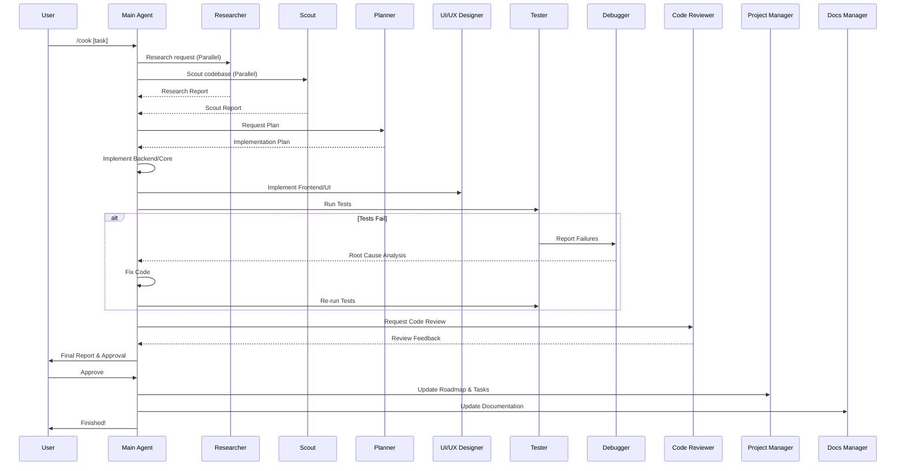
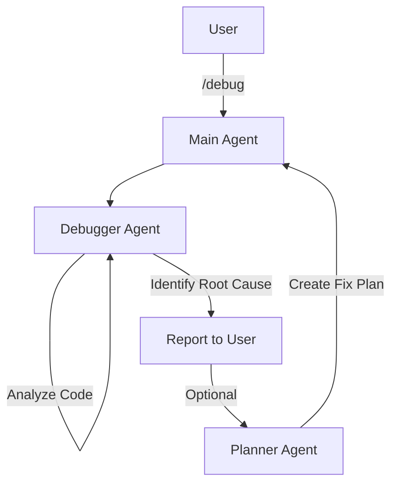
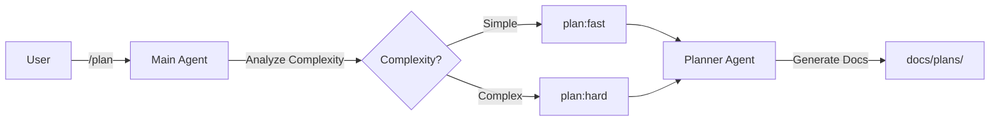
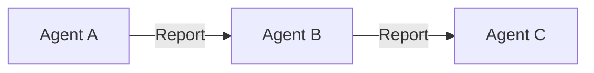
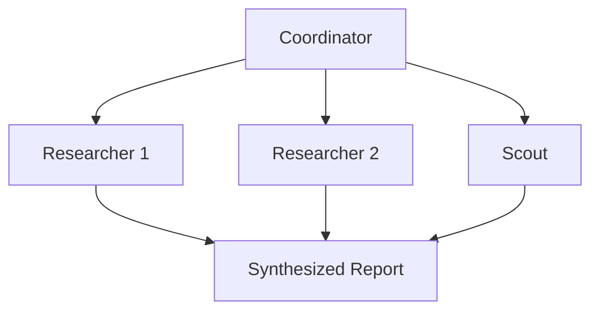

# Workflow Visualization

Tài liệu này trực quan hóa các quy trình phối hợp (orchestration) của AI Agent trong hệ thống Claude Anti-Chaotic bằng sơ đồ Mermaid.

## 1. Quy trình phát triển tính năng (/cook)

Quy trình phức tạp nhất, phối hợp nhiều Agent từ lập kế hoạch đến triển khai và kiểm thử.

## 2. Quy trình sửa lỗi (/debug)

Tập trung vào việc phân tích nguyên nhân gốc rễ.

## 3. Quy trình lập kế hoạch (/plan)

## 4. Các mẫu phối hợp phổ biến

### Chaining (Nối tiếp)

### Parallel Fan-Out (Song song)

---
*Tài liệu này được tạo tự động để hỗ trợ việc hiểu kiến trúc hệ thống.*